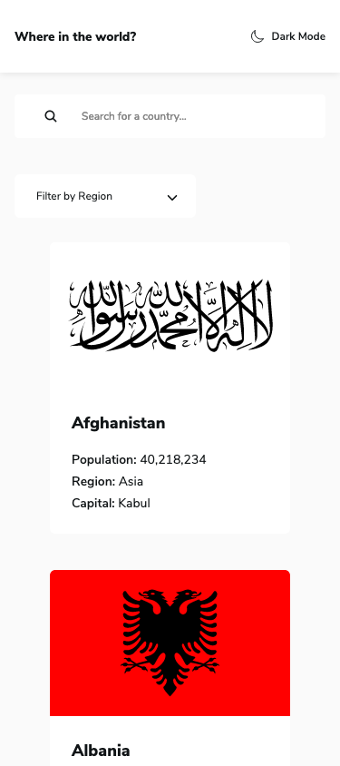
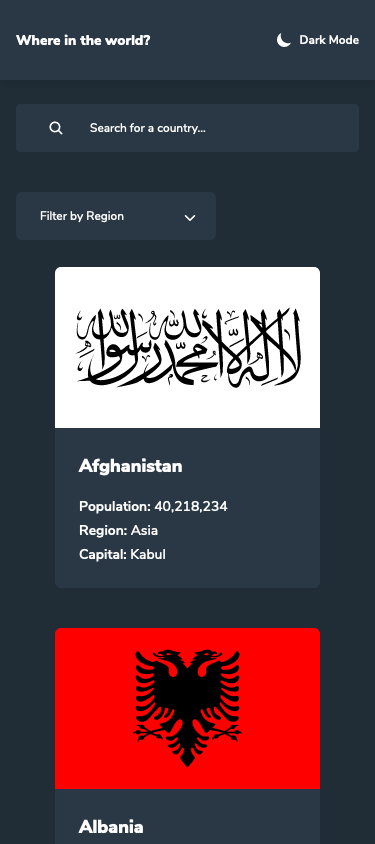
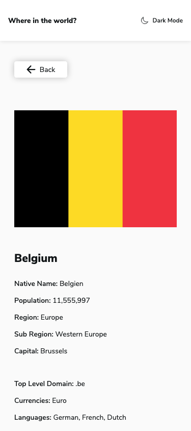
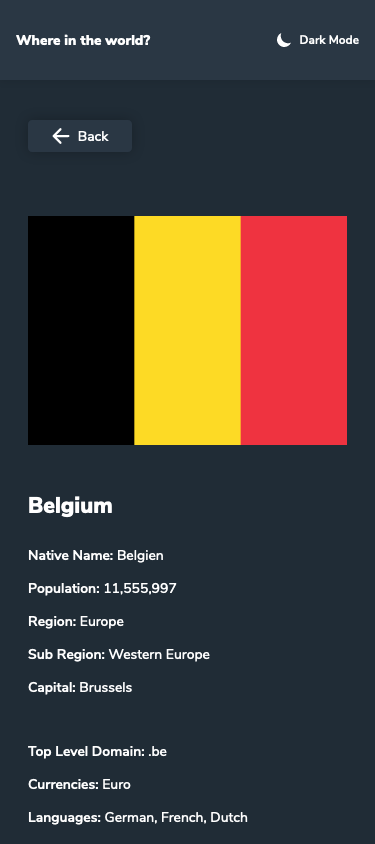
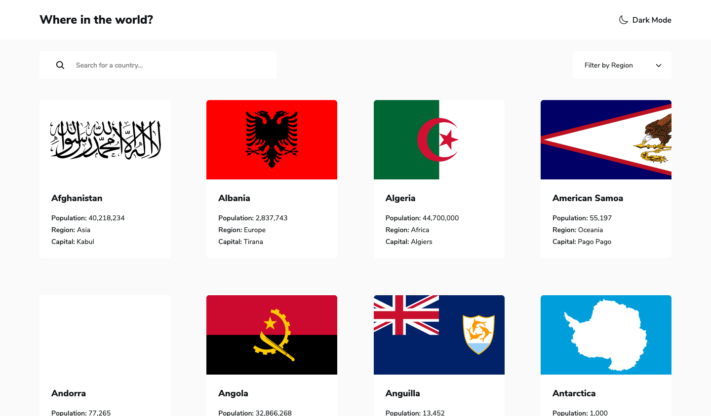
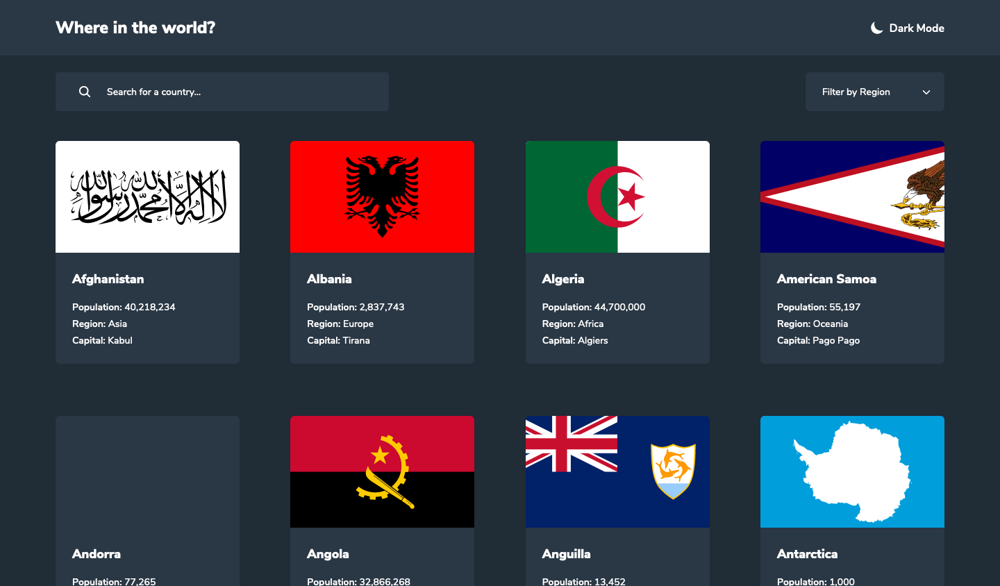
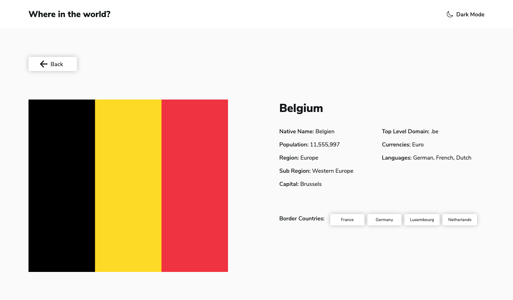
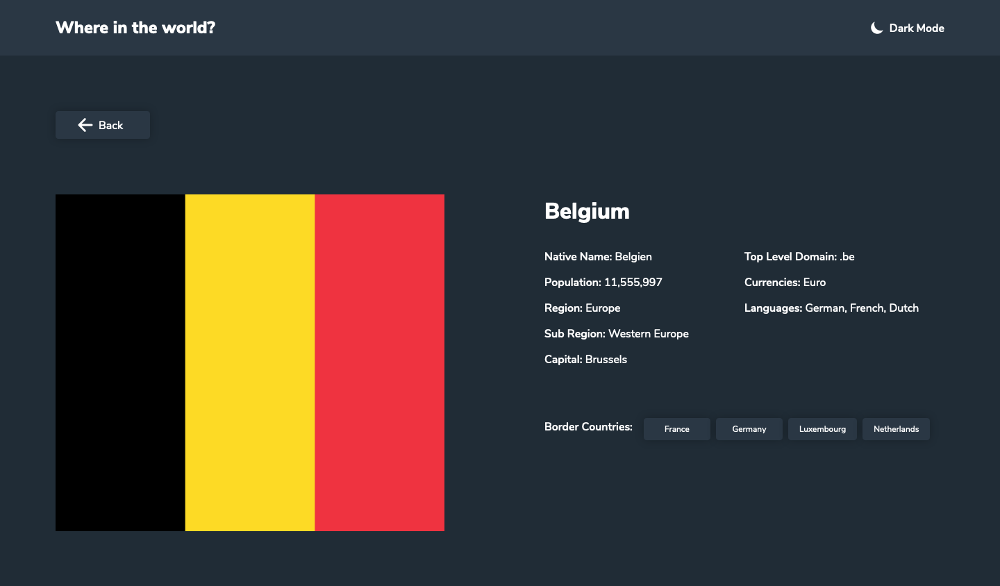

# Frontend Mentor - REST Countries API with color theme switcher solution

This is a solution to the [REST Countries API with color theme switcher challenge on Frontend Mentor](https://www.frontendmentor.io/challenges/rest-countries-api-with-color-theme-switcher-5cacc469fec04111f7b848ca). Frontend Mentor challenges help you improve your coding skills by building realistic projects.

## Table of contents

- [Overview](#overview)
  - [Screenshot](#screenshot)
  - [Links](#links)
- [My process](#my-process)
  - [Built with](#built-with)
- [Author](#author)

## Overview

### Screenshot

### Links

- Solution URL: [https://github.com/clementstorne/FrontendMentor-rest-countries-api-with-color-theme-switcher](https://github.com/clementstorne/FrontendMentor-rest-countries-api-with-color-theme-switcher)
- Live Site URL: [https://countries-clementstorne.netlify.app/](https://countries-clementstorne.netlify.app/)

## My process

### Built with

- React
- TypeScript
- Tailwind

## Author

- Github - [Clément Storne](https://github.com/clementstorne)
- Frontend Mentor - [@clementstorne](https://www.frontendmentor.io/profile/clementstorne)
- Twitter - [@clementstorne](https://twitter.com/clementstorne)
